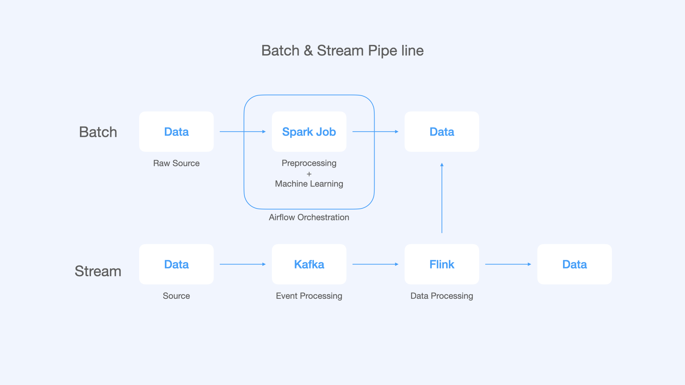

# 🚕 NewYork Taxi Pricing Predict
201637011 강동우

# Overview

> 과거 기반의 데이터와 실시간 데이터를 기반으로 수요와 공급의 예측을 통해 가격을 조정하려고 한다.

- 대용량 데이터의 아키텍쳐 설계와 파이프라인 구축을 위해 택시 요금을 예측한다.

### [🔗 Batch Processing](https://github.com/dustin-kang/newyork-taxi-pricing-predict/tree/main/batch)
 
### [🔗 Stream Processing](https://github.com/dustin-kang/newyork-taxi-pricing-predict/tree/main/stream)

# File Tree
```py
├── README.md
├── batch
│   ├── notebook
│   │   ├── taxi-analysis.ipynb # 택시비용 Spark-Sql 분석
│   │   ├── taxi-fare-prediction-hyper-parameter.ipynb # 택시 비용 하이퍼 파리머터 예측
│   │   ├── taxi-fare-prediction-preprocessing.ipynb # 택시 비용 전처리 
│   │   └── taxi-fare-prediction.ipynb # 택시 비용 머신러닝 예측
│   └── py # Notebook -> Python
│       ├── preprocessing.py 
│       ├── train_predict.py
│       └── tune_hyperparamenter.py
├── data
│   ├── model # 모델 데이터
│   │   ├── data
│   ├── taxi+_zone_lookup.csv 
│   ├── test # 평가 데이터 세트
│   ├── train # 훈련 데이터 세트
│   ├── parquet_to_csv # 파케어 -> CSV 변환 파일
│   └── trips # Raw data
├── stream
│   ├── data  # Kafka Data
│   ├── docker-compose.yml # compose 파일
│   ├── flink_taxi_pricing.py # 스트림 데이터 예측 실행 파일
│   ├── model.pkl # 머신러닝 예측 모델
│   ├── producer.py # kafka send 파일
│   ├── training_batch.py # 머신러닝 예측 파일
│   └── flink-sql-connector-kafka_2.11-1.14.0.jar # 오류 방지를 위한 커넥터 파일
└── templates # README 그림 자료
```

# Pipeline


1. **배치 프로세싱(기존 데이터 기반)**
    - 오프라인 배치 프로세싱에는 머신러닝 학습을 진행한다.
2. **스트리밍 프로세싱(실시간)**
    - 택시 요금, 이동 시간은 실시간으로 예측을 진행한다.


# Execute Plan
|No.|Title|Decription|Stack|
|---|---|---|---|
|1|New York Taxi Data Analysis (뉴욕 택시 데이터 분석)|뉴욕 택시 데이터 분석을 진행|`spark SQL`, `jupyter Notebook`|
|2|Taxi Pricing Prediction (택시비  예측)|택시비 예측 후 파라미터 최적화 및 모델 저장|`spark ML`, `jupyter Notebook`|
|3|Taxi Pricing PipeLine (택시비 예측 파이프라인 관리) |Airflow를 통해 택시비에 대한 파이프라인을 구축및 관리|`Airflow`, `Spark`|
|4|Taxi Pricing Event Processing (택시비 이벤트 처리) |카프카를 이용하여 택시 Producer, Topic을 만들고 메세지 확인할 수 있게 구현|`Kafka`, `Spark`|
|5|Taxi Pricing (택시정보 받아 택시비 예측) |Flink를 이용하여 택시 정보를 받아 택시비 예측|`Flink`, `Spark`|

