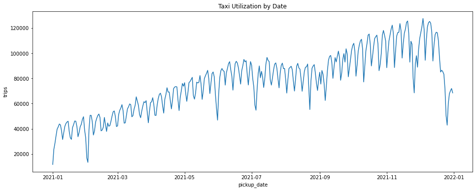
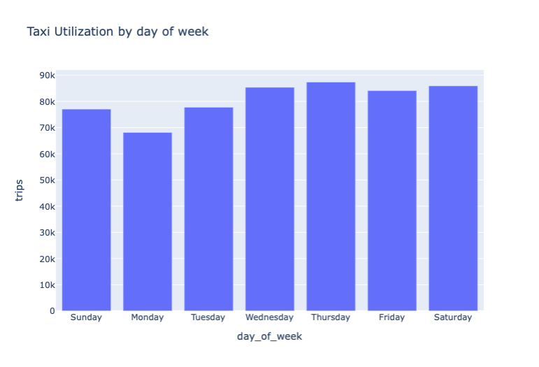
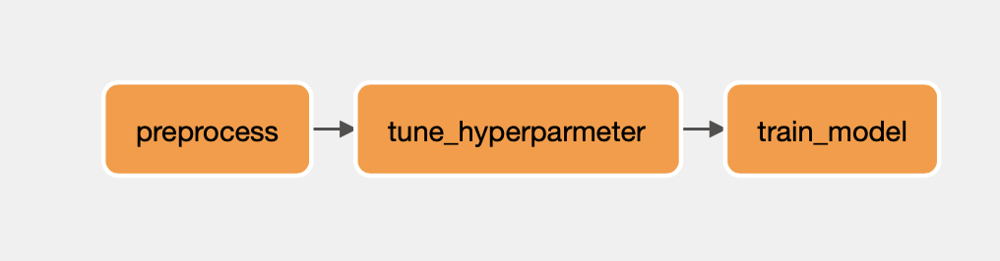

# Batch Process
   

```
1. TLC 사이트에서 데이터를 수집 후 Spark SQL 쿼리를 통해 데이터 프레임 생성 
2. Outlier 제거를 위한 데이터 클리닝
3. 시각화 작업 
    - `pickup_date`를 활용한 택시 이용률
    - `DATE_FORMAT` 이나 사용자 정의 함수를 이용해 요일별 택시 이용률
    - 사용자 정의 함수를 이용해 지불 타입 도출
```

## 1. 분석 및 시각화



- 우선, 택시 이용자 수가 증가하는 것을 알 수 있으며, 요일 마다 격차가 크다는 것을 알 수 있었다.
- 요일 별로 보게되면, 다른 요일에 비해 월요일 택시 이용자 수가 적다는 것을 알 수 있다.


- 지불 방식에 대해서는 Credit Card로 지불하는 사람들이 가장 많으며, 금액에 대한 분쟁도 꽤 일어난다는 것을 알 수 있다.

## 2. 머신러닝 예측
|No|r2 score|RMSE|Description|Link|
|---|---|---|---|---|
|1|0.70|7.91|초기 예측 모델|[💾](https://github.com/dustin-kang/newyork-taxi-pricing-predict/blob/main/batch/notebook/taxi-fare-prediction.ipynb)|
|2|0.81|6.2|OneHot Encoding, Standard Scaling, Vector Assembler등 전처리|[💾](https://github.com/dustin-kang/newyork-taxi-pricing-predict/blob/main/batch/notebook/taxi-fare-prediction-preprocessing.ipynb)|
|3|0.81|6.2|Parameter Tuning (elesticNet, Regression)|[💾](https://github.com/dustin-kang/newyork-taxi-pricing-predict/blob/main/batch/notebook/taxi-fare-prediction-hyper-parameter.ipynb)|

- 10마일 정도 가는데 41불 정도로 예측되었고 거리가 길수록 예측 확률도 높아진다는 것을 알 수 있었다. (초기 예측)
- 전처리 이후, 좋은 성능이 나온 것으로 확인되었다.

## 3. Batch Data Pipeline 구축


택시비 예측을 위해 `Airflow`를 이용하여 파이프라인을 구축한다. 
```
preprocess >> tune_hyperparameter >> train_predict
```


## 🆘 Error Note
- 데이터 클리닝 도중, `total_amount` 와 `trip_distance`등 에서 이상값(Outlier)를 발견
    > 해결 : `WHERE` 을 통해 새 쿼리를 만들어 데이터 전처리
- 초기 예측 성능이 70%(R2)정도 나왔다. 좋은 성능은 아니지만 적당한 결과였다. 
- `OneHoTEncoding`과 `StandardScaler`, `VectorAssembler`를 통해 numerical Data와 Categorical data를 전처리 한 컬럼을 이용해 예측 성능을 내보았다.
    > 해결 : 지난 초기 예측 성능 보다 10% 향상된 좋은 성능이 나왔다. (80%)
    > 해결2 : 파라미터 튜닝을 진행하였지만 차이가 없는 같은 성능이 나왔다.
- Airflow와 Local Python의 환경이 맞지 않아 생기는 문제 발생
    ```
    airflow.exceptions.AirflowException: Cannot execute: spark-submit --master yarn --name arrow-spark /Users/dongwoo/new_york/batch/py/preprocess.py. Error code is: 1.
    ```
    > 해결 : 위 코드를 입력하여 재 실행!
