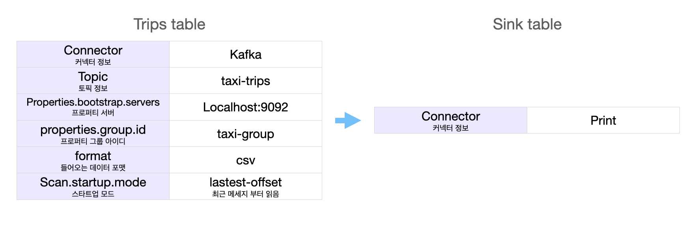
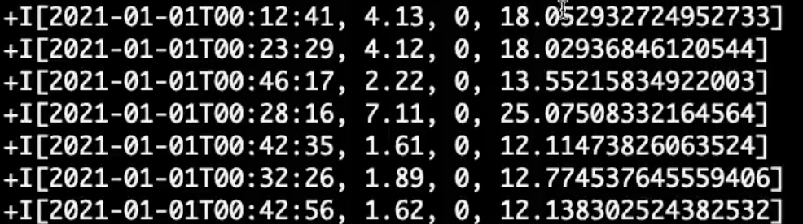

# Stream Process
   

```
1. Compose up 하여 kafka 클러스터를 만든후 토픽 생성  이후 Producer 동작 확인
2. Sourece 테이블에서 Sink 테이블로 옮기는 작업
    - 머신러닝 예측 모델 생성
    - UDF 함수를 생성하여 Source Table 데이터를 Sink Table로 머신러닝을 통해 택시비 예측 값 전달
```


## 1. 택시 Trips 데이터를 보낼 Producer 만들기


1. 택시 Trips 데이터를 통해 Price 예측하는 과정이다.

2. compose 파일을 만듭니다.
    - zookeeper
    - kafka
    - kafdrop

3. `docker-compose up`으로 kafka 클러스터를 만든다.

4. [LocalHost](http://localhost:9000)링크를 통해 KafDrop이 열리는 것을 확인하였다.
    - `taxi-trips` 라는 토픽을 생성합니다.

5. producer 파일을 이용해서 데이터를 보내준다.

## 2. Flink를 통해 택시 정보를 받아오기
1. 데이터를 받을 Kafka Consumer는 내장되어 있지 않기 때문에  오류 발생을 막기 위해 `kafka connector`를 다운 받는다.

```py
kafka_jar_path = os.path.join(
  os.path.abspath(os.path.dirname(__file__)), "../",
  "flink-sql-connector-kafka_2.11-1.14.0.jar"
)
t_env.get_config().get_configuration().set_string(
  "pipeline.jars", f"file://{kafka_jar_path}"
)
```
2. Flink을 이용하여 Stream 환경으로  SourceTable을 Sink Table로 보낸다.
    - `pip install apache-flink`
    - `pip install flink`

3. `training_batch`로 머신러닝 예측 모델 파일을 만든다.

4. `udf` 함수를 정의하여  `pickup_ts(픽업시간))`, `trip_distance(거리)`, `trip_hour(시간:Hour)` 를 이용하여 모델링한 파일로 Flink를 통해 받아온 택시 정보의 택시 비용을 예측한다.




## 🆘 Error Note
- `Error Starting userland proxy: listem tcp 0.0.0.0:XXXX: bind: address already in ~` 으로 포트가 겹쳐서 에러가 발생했다.
    > 해결 :  `netstat` 으로 포트를 확인한 후 이미 사용중인 상태라면 `docker-compose down docker rm -fv` 로 컨테이너를 제거했다.
    > - `kill -9 PID`로 포트를 제거할 수 있다. 

- `UnicodeDecodeError: 'utf-8' codec can't decode byte 0x8b in position 19: invalid start byte`
    - `parquet` 파일을 인코딩했을 때, read한 로우 값이 제대로 인코딩 되지 않았다.
    - `cp949`를 사용했지만 변화가 없자 parquet to csv를 했다.
    - [참고링크](https://blog.naver.com/PostView.nhn?blogId=koys007&logNo=221850810999)
