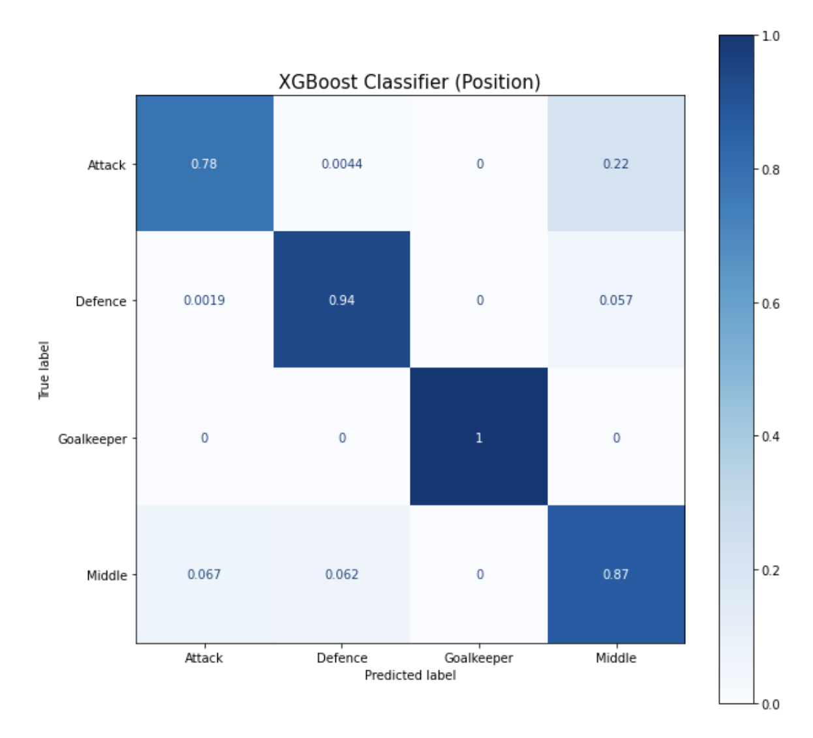
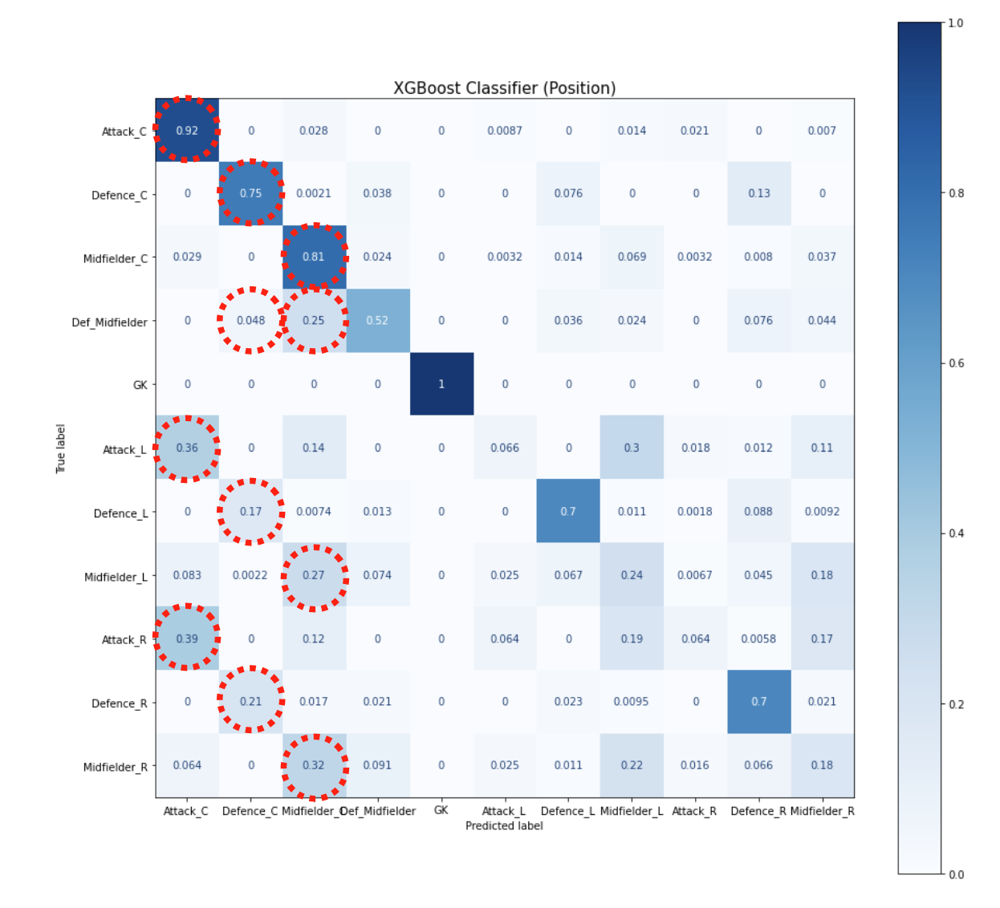
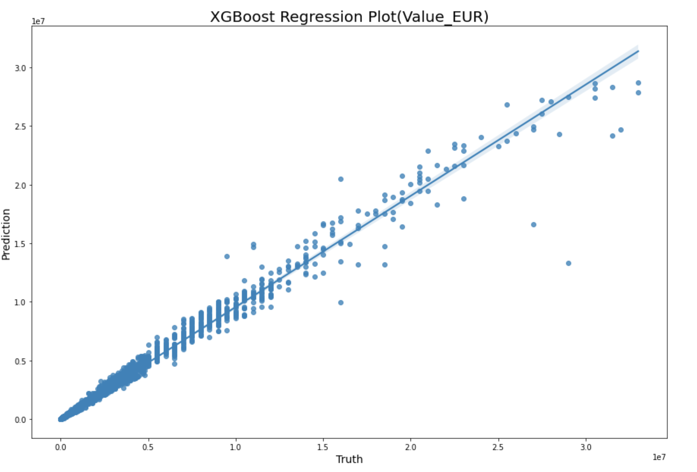
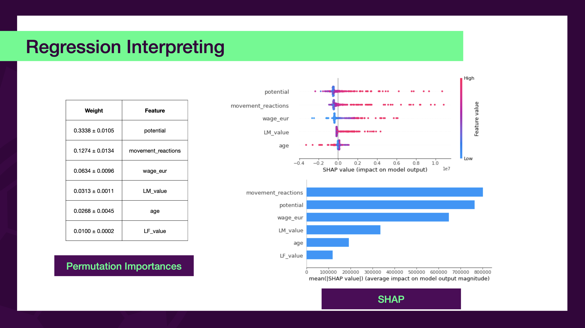

# ⚽️ 축구선수 머신러닝 예측 (Soccer Player ML Prediction)

## 배경
`Soccer Players 21` 이라는 축구선수들의 데이터를 활용하여 실제 경기에서 선수들 각자 개개인의 능력을 재배치를 할 수 있지 않을까 생각했습니다. 추가로, 해당 데이터 셋을 선택하여 다른 인사이트를 도출할 수 있지 않을까도 고려해봤습니다.


## 진행 방향
1. 축구선수들의 포지션 분류를 통한 재배치 여부 도출
2. 축구선수들의 능력별 가치 예측

## 내부 디렉토리 구조
```bash
.
├── Presentation File.pdf # 발표 자료
├── README.md 
├── data # 축구선수 데이터
│   ├── README.md
│   ├── cls_data_11p.csv # 11개의 포지션으로 분류된 분류용 데이터
│   ├── cls_data_4p.csv # 4개의 포지션으로 분류된 분류용 데이터
│   ├── players_21.csv # 기존 Kaggle 데이터
│   └── reg_data.csv # 선수들의 가치 예측을 위한 데이터
├── image
│   ├── classifier11.png # 분류 시각화 이미지
│   ├── classifier4.png # 분류 시각화 이미지
│   ├── interpreting.png # 결과 해석 시각화 이미지
│   └── regression.png # 회귀 예측 시각화 이미지
├── jupyter Notebook
│   ├── Feature Selection.ipynb # CrossValidation, SelectKBest
│   ├── Hyperparameter_Tuning_Regressor.ipynb # 하이퍼 파라미터 튜닝을 한 회귀 예측
│   ├── classifier_11.ipynb # 11개의 포지션 분류 
│   ├── classifier_4.ipynb # 4개의 포지션 분류
│   ├── hyperparameter_Tuning_Classifier.ipynb # 하이퍼 파라미터 튜닝을 한 분류
│   ├── processing.ipynb # 전처리 과정
│   ├── regression.ipynb # 선수 가치 회귀 예측
│   └── visualization.ipynb # plotly 시각화
└── python # 파이썬 변환 자료
    ├── Feature Selection.py 
    ├── Hyperparameter_Tuning_Regressor.py
    ├── classifier_11.py
    ├── classifier_4.py
    ├── hyperparameter_Tuning_Classifier.py
    ├── processing.py
    ├── regression.py
    └── visualization.py
```

## 사용 프로그램
- **jupyter Notebook** : Python을 통한 머신러닝 예측 및 분류


## 제작 과정
|No|Title|date|description|
|------|---|---|---|
|1|EDA & Processing & Visualization |22.11.08 ~ 22.11.09|초기 전처리 과정이므로, 무관련 데이터 제거,데이터 합치, 데이터 형태 변환등을 진행하여 분류와 회귀 인사이트를 도출해냄. |
|2|Classification|22.11.09|포지션에게 맞게 타겟값을 정리한 후 4개의 포지션, 11개의 포지션으로 다중 클래스 분류를 진행하였음.|
|3|Regression|22.11.10|선형회귀부터 랜덤포레스트까지의 모델을 이용하여 선수들의 가치예측을 진행하였음.|
|4|Feature Selection|22.11.11|워낙 특성의 수가 많기 때문에 학습에 도움이 될 특성만 사용하는 방법을 진행함. (SelectKBest, CrossValidation) 하지만 더 좋은 성능을 나타내진 않았음.
|5|HyperParameter Tuning Classifier | 22.11.12| GridSearchCV를 이용한 하이퍼 파라미터 튜닝 및 elio, Shap로 머신러닝 해석
|6|HyperParameter Tuning Regression | 22.11.12| GridSearchCV를 이용한 하이퍼 파라미터 튜닝 및 elio, Shap로 머신러닝 해석

## 이슈
- ~전처리 과정 중 선수들의 포지션을 국가팀, 리그팀, 일반포지션(복수) 중 어떻게 처리해야할지 고민함.~
    - 결측치 개수를 판단하여 해결.
- ~선수들의 능력 특성(pace, shooting, passing, dribbling, defending, physic)에 골기퍼 특성이 NaN 값임~
  - 해당 데이터가 존재하지 않기 때문에 0으로 처리한 후, 골기퍼만의  능력(goalkeeping_diving)으로 골기퍼 선수 예측
- ~다중 클래스 분류에 사용할 타겟(target)값들이 너무 많아 정확도가 떨어질 것 같음. 줄일 필요가 있음.~
  ```
    - Attack (공격수)
      - CF, LWF, ST, RWF (중앙공격수, 윙 포워드, 스트라이커)
    - Goalkeeper (골기퍼)
      - GK(골키퍼)
    - Middle (미드필더)
      - AM, LM, CM, RM, DM (공격,수비형 미드필더, 양옆 중앙 미드필더)
    - Defence(수비수)
      - LWB, RWB, LB, RB, CB, SW (윙백, 풀백, 센처백, 스위퍼)
  ```
  - 위방식 대로 분류하도록함.
  

## 프로젝트 결과
### 포지션 분류 예측



- 가장 성능이 좋았던 모델은 RandomForest와 XGB였고 베이스라인 모델보다는 높은 성능을 보였음.
- 하이퍼 파리미터를 이용한 모델 개선 이전 보다는 큰 차이가 없는 **정확도 점수(0.90)** 의 결과가 나왔지만 훈련세트와 시험 세트 간격을 줄일 수 있었음.


- 실제 공격수가 윙 포워드 좌우측 공격로 잘못 분류된 경우가 있었음.
  - 선수들이 센터 스트라이커 뿐만 아니라 좌우 측 스트라이커로 뛸 수 있다는 판단을 할 수 있음. 

### 선수 가치 회귀 예측


- 이전 보다 **R2Score 점수(0.982)** 가 많이 늘었다는 것을 알 수 있음. 



- 선수들의 몸값 가치는 선수들의 잠재성(potential), 움직임(movement_reactions), 임금(wage_eur)에 중요한 역할을 함.
- 나이가 어릴수록 잠재력이 높을수록 움직임이 높을수록 선수들의 몸값은 증가함.

## 피드백
몸값 예측을 중점으로 포지션별로 시각화를 하던가 아니면 나이별로 어느 포지션이 많은지도 시각화해보면 좋을 것 같다.